# JurasSigLIP

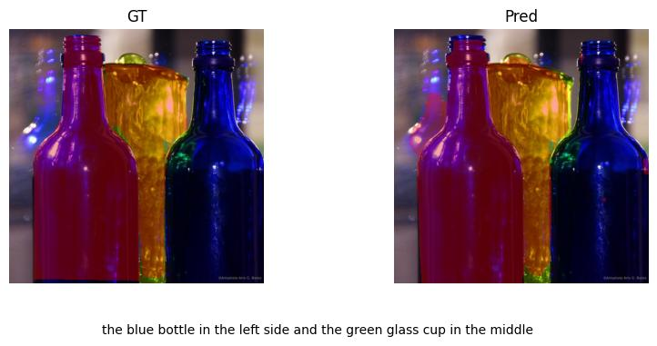

JurasSigLIP is a text-guided segmentation prototype that fuses DINOv3 vision tokens with SigLIP2 text tokens via cross-attention. It aligns global image and text features with a contrastive objective, then trains a segmentation head to produce pixel-level masks conditioned on natural-language captions.

## Project highlights

- Vision backbone: DINOv3 ViT (LoRA-adapted), patch tokens and CLS token
- Text backbone: SigLIP2 text tower (LoRA-adapted), sequence tokens and global text feature
- Fusion: multi-head cross-attention from vision patches to text tokens
- Outputs: segmentation mask logits upsampled to 512x512
- Training: contrastive pretraining for global alignment, then segmentation finetuning with Dice + Focal loss

## Architecture

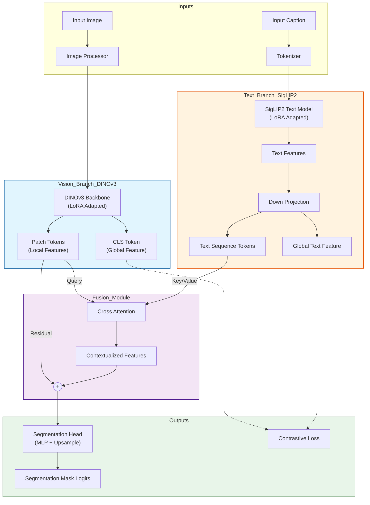

## Data

The notebook uses COCO train2014 images and a GRef-style referring expression dataset (via `grefs(unc).json`) with instance masks from COCO annotations. Each image can have multiple captions, and the dataset pairs each caption with the same segmentation mask for that target.

## Training flow

1. Contrastive pretraining
   - Align global image and text embeddings with a CLIP-style contrastive loss.
   - Train LoRA-adapted backbones plus logit scale.
2. Segmentation training
   - Freeze most parameters; train cross-attention and segmentation head.
   - Optimize Dice + Focal loss on per-caption masks.

Key hyperparameters from the notebook:
- Shared embedding dim: 384
- Image size: 512
- LoRA: r=8, alpha=16, dropout=0.0
- Backbones: DINOv3 ViT-S/16+, SigLIP2 base patch16-512

## Training curves

Contrastive pretraining:

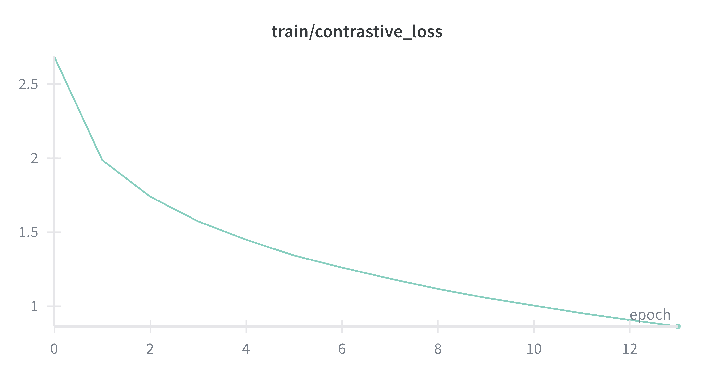
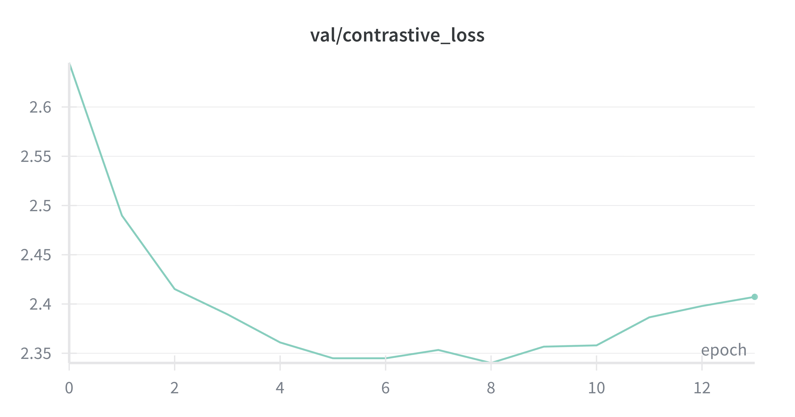

Segmentation finetuning:

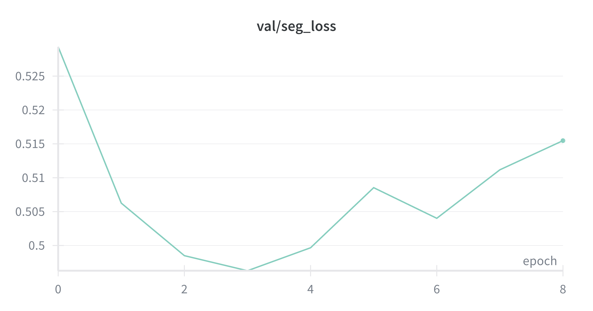

## Validation comparisons

Each folder in `val/` contains one image with multiple captions. The different captions produce different segmentation outputs.

### Example 1

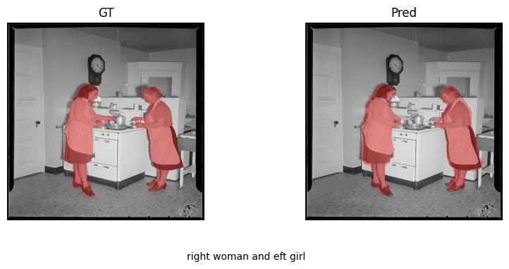
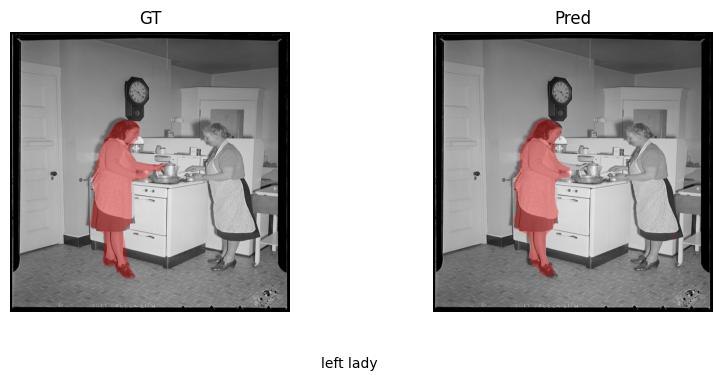
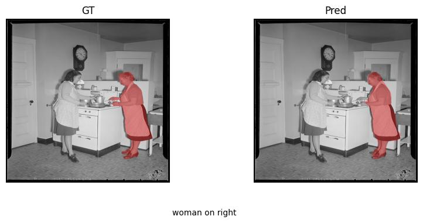

### Example 2

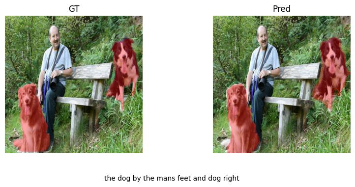
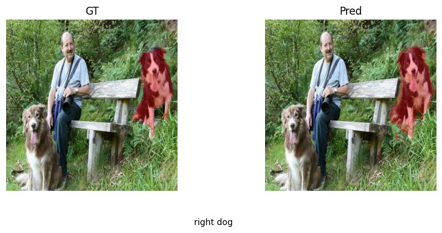

### Example 3

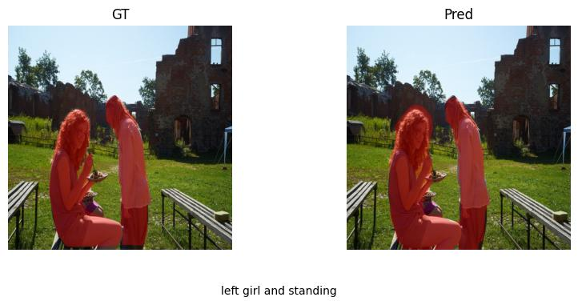

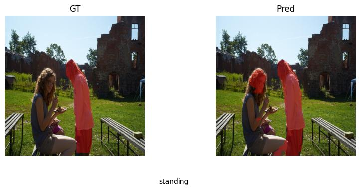

### Example 4

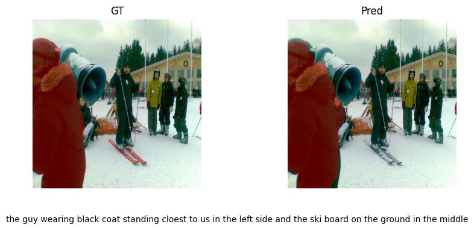
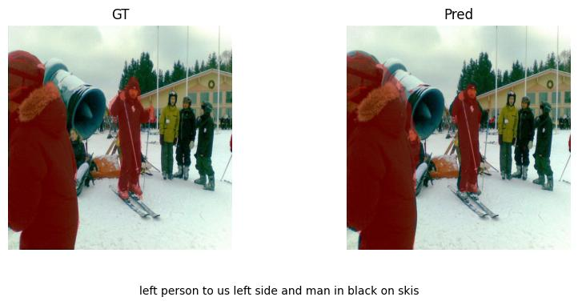

### Example 5

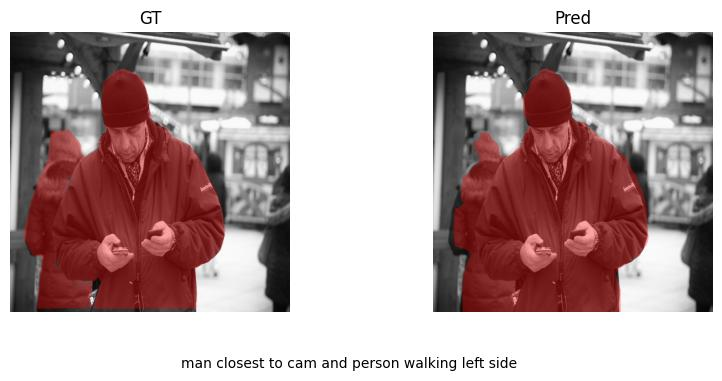
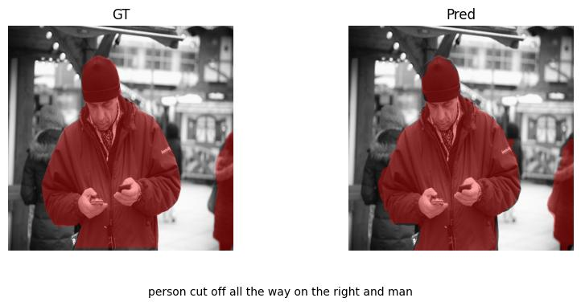
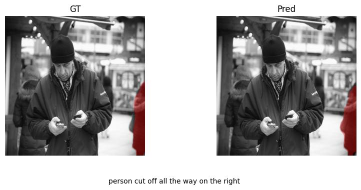

### Example 6

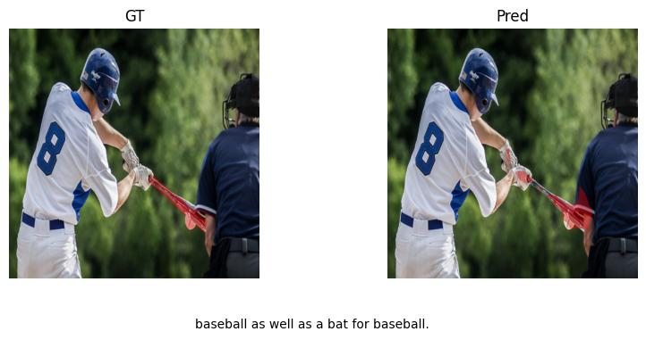
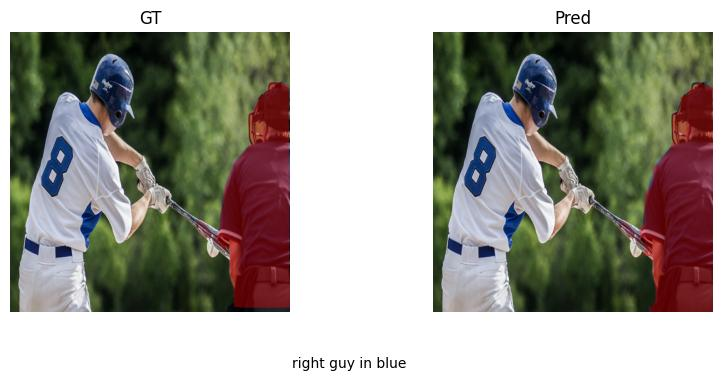

### Example 7

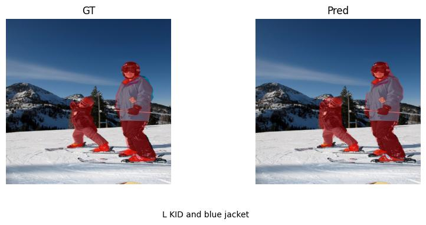

### Example 8

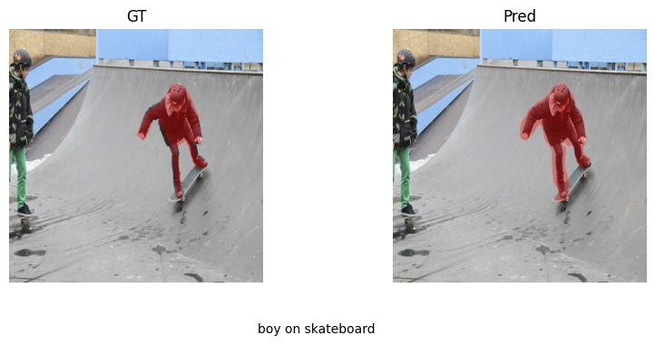

### Example 9

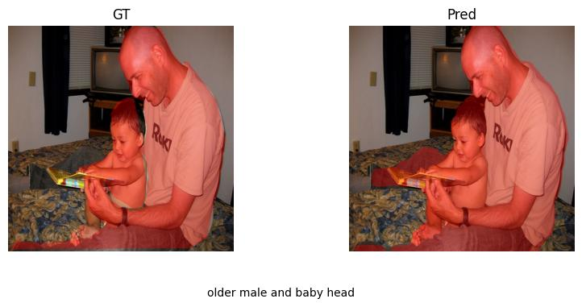
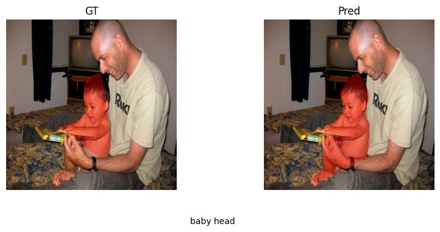

### Example 10

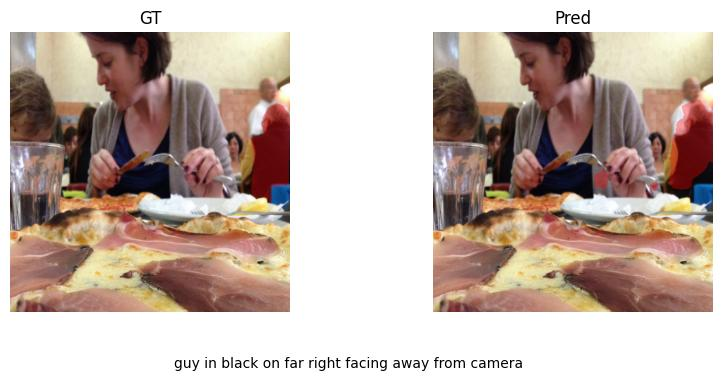
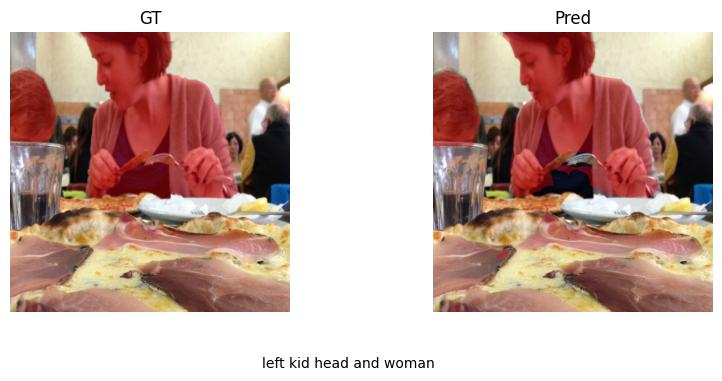

## How to run

Open `jurasSigLIP.ipynb` and run the cells in order. Update the dataset paths to your local setup and ensure a CUDA-capable GPU is available for mixed-precision training. You must provide the two JSON files (`grefs(unc).json` and `instances.json`) and a folder with all segmented images named `gref_images` as referenced in the notebook paths.

## References

- Liu, Chang, Henghui Ding, and Xudong Jiang. “GRES: Generalized Referring Expression Segmentation.” In Proceedings of the IEEE/CVF Conference on Computer Vision and Pattern Recognition (CVPR), 2023.
- He, Shuting, Henghui Ding, Chang Liu, and Xudong Jiang. “GREC: Generalized Referring Expression Comprehension.” arXiv preprint arXiv:2308.16182, 2023.
- Kamath, Aishwarya, Mannat Singh, Yann LeCun, Gabriel Synnaeve, Ishan Misra, and Nicolas Carion. “MDETR: Modulated Detection for End-to-End Multi-Modal Understanding.” arXiv preprint arXiv:2104.12763, 2021.
